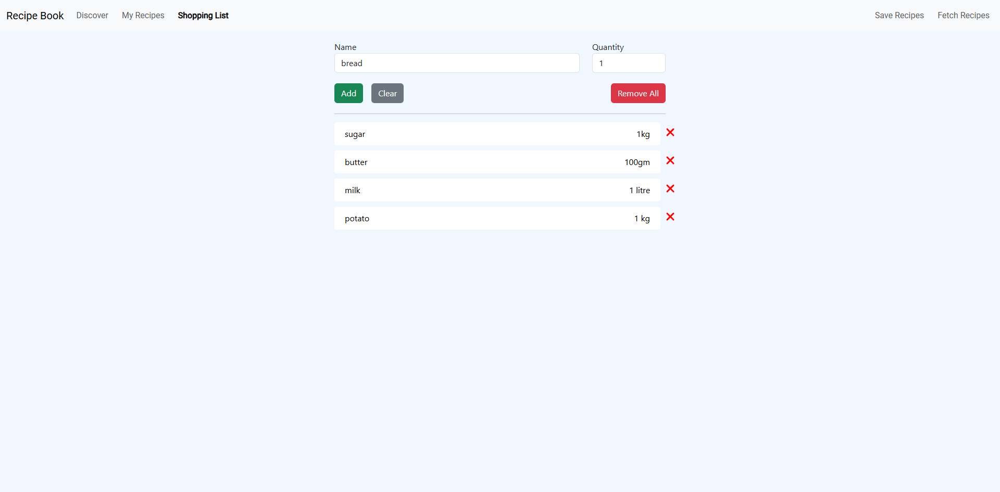
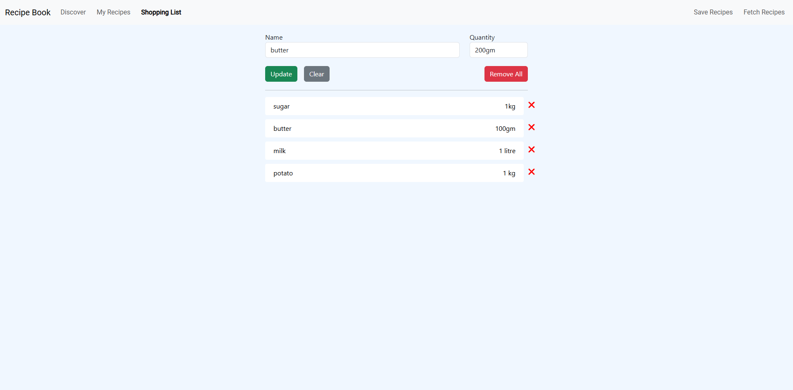
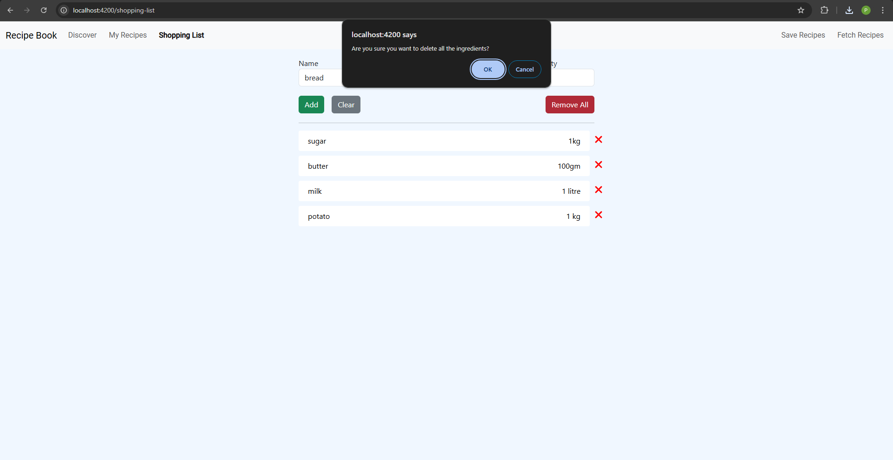
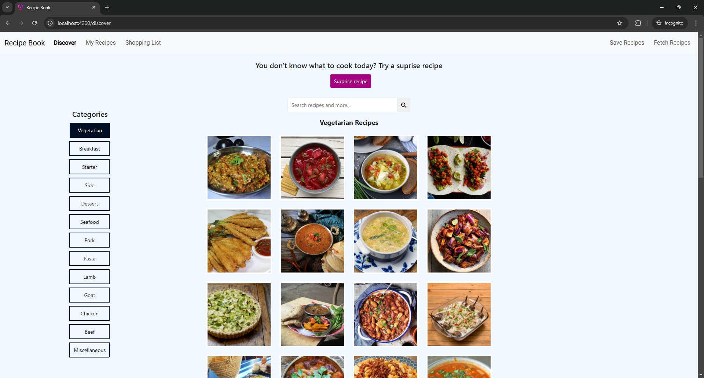
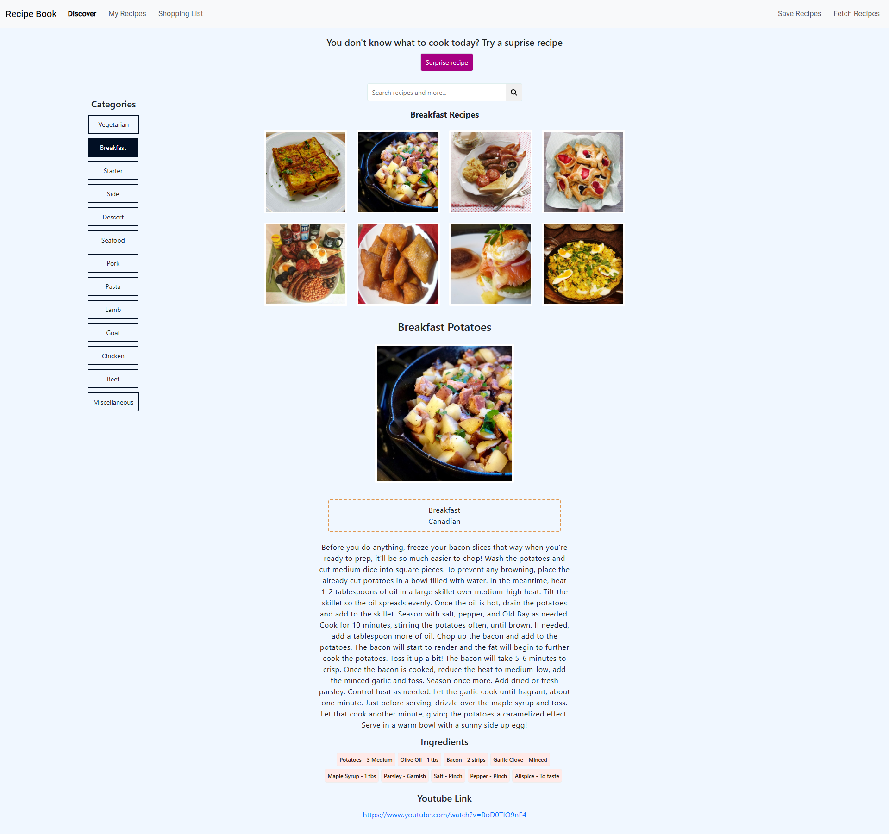
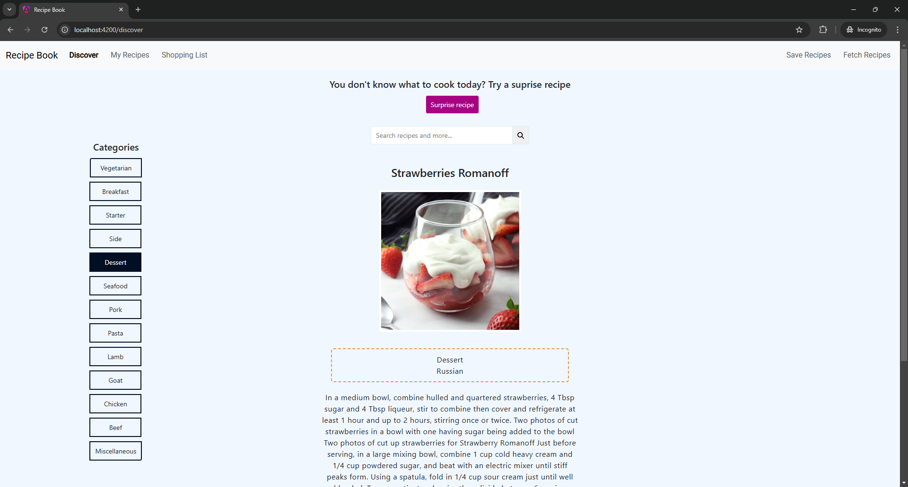

# RecipeBook App

An app designed to empower users with recipe management features, allowing them to create new recipes, edit or delete existing ones, and effortlessly explore a wide range of new recipes. Additionally, users can streamline their grocery planning by adding ingredients directly to shopping lists, as well as updating or removing items from these lists.

### Demo

Screenshots

#### My Recipes

#### Shopping List

#### Discover

This project was generated using Angular CLI version 19.0.4.
